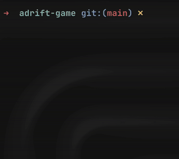

# Haskell Practice Projects



This repository is a collection of personal projects and exercises I've written to practice and explore the Haskell programming language.

## Projects Overview

### Adrift Game
"Adrift" is a text-based puzzle game set in space. The player controls a ship and must navigate a grid containing space rocks. The core mechanic is that movement in any direction (`north`, `south`, `east`, `west`) continues in a straight line until the ship collides with an object. The objective is to strategically use these "all-or-nothing" moves to reach a specific destination on the map. The game is a challenge of logic and spatial reasoning, built in a purely functional style.

### Haskell Practice
This section contains a variety of exercises and smaller projects covering different aspects of Haskell.
- **Daily Practices**: A series of files containing solutions to various programming challenges, focusing on list manipulation, recursion, and data type definitions.
- **Formal Semantics**: An exploration of language interpreters. It starts with an `intro-to-formal-semantics.hs` file that builds up the necessary data structures (Abstract Syntax Trees) and culminates in `small-step-evaluator.hs`, a complete interpreter for a simple imperative language using small-step operational semantics.

## Structure

The repository is organized as follows:

-   `adrift-game/`: Contains the source code for the "Adrift" game.
-   `haskell-practice/`: Contains the practice exercises and projects.

## How to Run the Game

To run the "Adrift" game, you'll need the [Glasgow Haskell Compiler (GHC) and Cabal](https://www.haskell.org/downloads/) installed.

1.  Navigate to the `adrift-game` directory:
    ```sh
    cd adrift-game
    ```

2.  Build the project. This will automatically download and install all the necessary dependencies.
    ```sh
    cabal build
    ```

3.  Run the game:
    ```sh
    cabal run
    ```